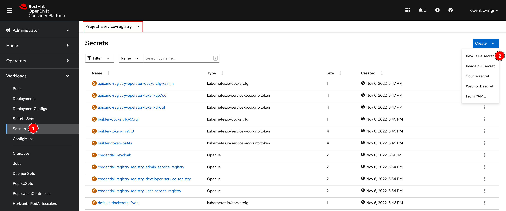
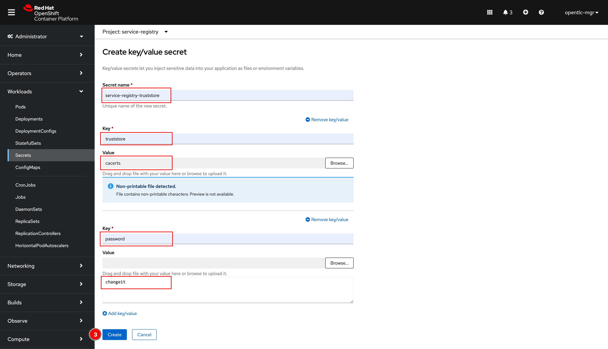
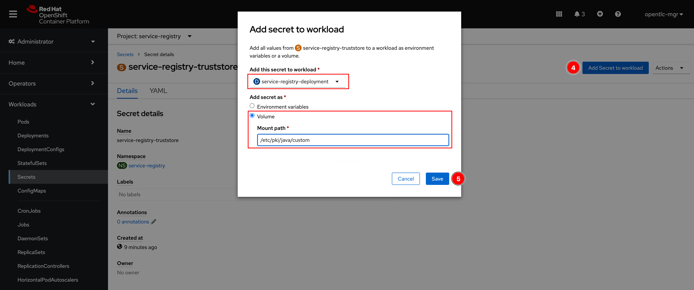
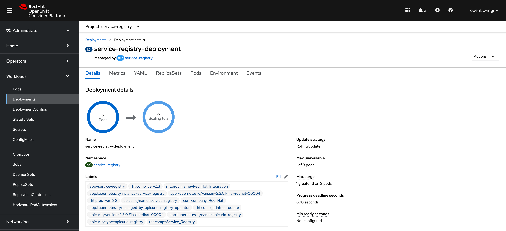
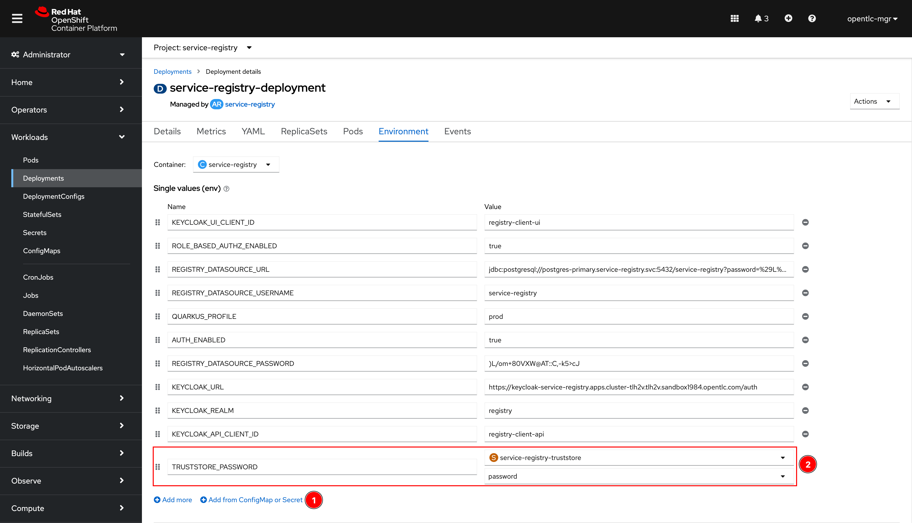
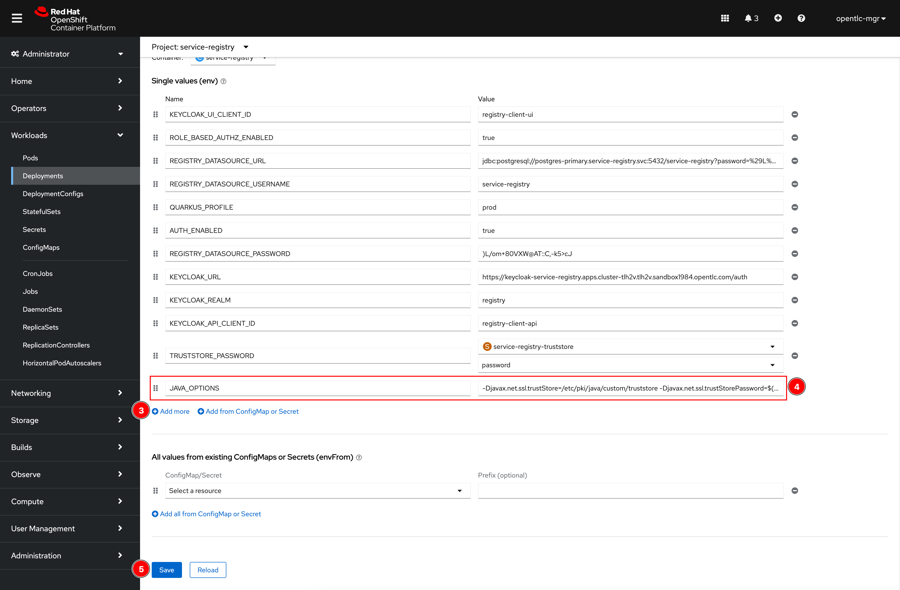
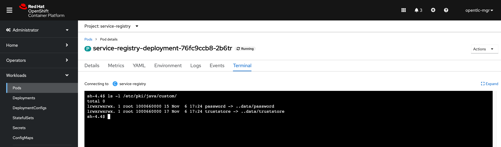
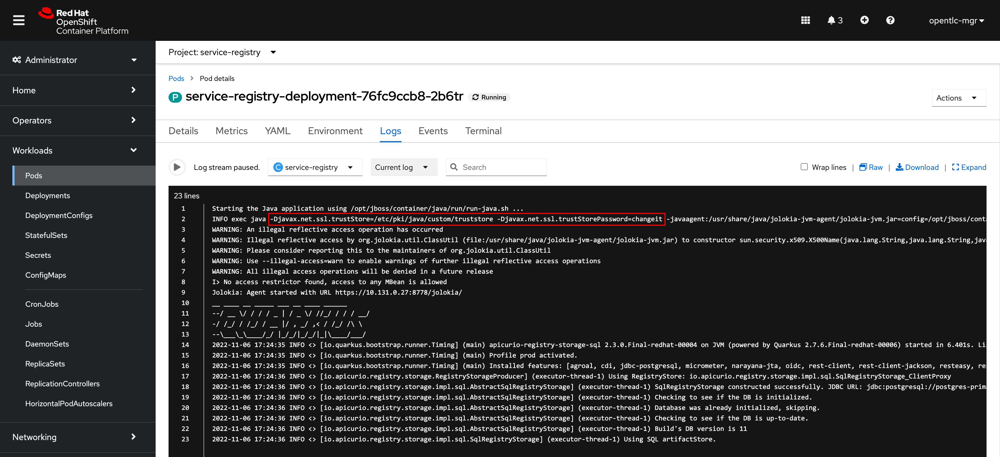

# Service Registry & SSO Integration with Self-Signed Certificate

When securing Service Registry using Red Hat SSO that has HTTPS endpoint set up with a self-signed certificate, you might end up with following error when starting the Service Registry container.

```log
__  ____  __  _____   ___  __ ____  ______
 --/ __ \/ / / / _ | / _ \/ //_/ / / / __/
 -/ /_/ / /_/ / __ |/ , _/ ,< / /_/ /\ \
--\___\_\____/_/ |_/_/|_/_/|_|\____/___/
2022-08-05 09:24:44,968 INFO  [org.apa.kaf.con.jso.JsonConverterConfig] (main) JsonConverterConfig values:
 converter.type = key
 decimal.format = BASE64
 schemas.cache.size = 0
 schemas.enable = true

Aug 05, 2022 9:24:47 AM org.jboss.threads.Version <clinit>
INFO: JBoss Threads version 3.2.0.Final-redhat-00003
Aug 05, 2022 9:24:48 AM io.quarkus.runtime.ApplicationLifecycleManager run
ERROR: Failed to start application (with profile prod)
sun.security.provider.certpath.SunCertPathBuilderException: unable to find valid certification path to requested target
 at java.base/sun.security.provider.certpath.SunCertPathBuilder.build(SunCertPathBuilder.java:141)
 at java.base/sun.security.provider.certpath.SunCertPathBuilder.engineBuild(SunCertPathBuilder.java:126)
 at java.base/java.security.cert.CertPathBuilder.build(CertPathBuilder.java:297)
 at java.base/sun.security.validator.PKIXValidator.doBuild(PKIXValidator.java:434)
 at java.base/sun.security.validator.PKIXValidator.engineValidate(PKIXValidator.java:306)
 at java.base/sun.security.validator.Validator.validate(Validator.java:264)
 at java.base/sun.security.ssl.X509TrustManagerImpl.validate(X509TrustManagerImpl.java:313)
 at java.base/sun.security.ssl.X509TrustManagerImpl.checkTrusted(X509TrustManagerImpl.java:276)
 at java.base/sun.security.ssl.X509TrustManagerImpl.checkServerTrusted(X509TrustManagerImpl.java:141)
 at java.base/sun.security.ssl.CertificateMessage$T12CertificateConsumer.checkServerCerts(CertificateMessage.java:632)
 at java.base/sun.security.ssl.CertificateMessage$T12CertificateConsumer.onCertificate(CertificateMessage.java:473)
 at java.base/sun.security.ssl.CertificateMessage$T12CertificateConsumer.consume(CertificateMessage.java:369)
 at java.base/sun.security.ssl.SSLHandshake.consume(SSLHandshake.java:392)
 at java.base/sun.security.ssl.HandshakeContext.dispatch(HandshakeContext.java:443)
 at java.base/sun.security.ssl.SSLEngineImpl$DelegatedTask$DelegatedAction.run(SSLEngineImpl.java:1074)
 at java.base/sun.security.ssl.SSLEngineImpl$DelegatedTask$DelegatedAction.run(SSLEngineImpl.java:1061)
 at java.base/java.security.AccessController.doPrivileged(Native Method)
 at java.base/sun.security.ssl.SSLEngineImpl$DelegatedTask.run(SSLEngineImpl.java:1008)
 at io.netty.handler.ssl.SslHandler.runAllDelegatedTasks(SslHandler.java:1557)
 at io.netty.handler.ssl.SslHandler.runDelegatedTasks(SslHandler.java:1571)
 at io.netty.handler.ssl.SslHandler.unwrap(SslHandler.java:1455)
 at io.netty.handler.ssl.SslHandler.decodeJdkCompatible(SslHandler.java:1282)
 at io.netty.handler.ssl.SslHandler.decode(SslHandler.java:1329)
 at io.netty.handler.codec.ByteToMessageDecoder.decodeRemovalReentryProtection(ByteToMessageDecoder.java:501)
 at io.netty.handler.codec.ByteToMessageDecoder.callDecode(ByteToMessageDecoder.java:440)
 at io.netty.handler.codec.ByteToMessageDecoder.channelRead(ByteToMessageDecoder.java:276)
 at io.netty.channel.AbstractChannelHandlerContext.invokeChannelRead(AbstractChannelHandlerContext.java:379)
 at io.netty.channel.AbstractChannelHandlerContext.invokeChannelRead(AbstractChannelHandlerContext.java:365)
 at io.netty.channel.AbstractChannelHandlerContext.fireChannelRead(AbstractChannelHandlerContext.java:357)
 at io.netty.channel.DefaultChannelPipeline$HeadContext.channelRead(DefaultChannelPipeline.java:1410)
 at io.netty.channel.AbstractChannelHandlerContext.invokeChannelRead(AbstractChannelHandlerContext.java:379)
 at io.netty.channel.AbstractChannelHandlerContext.invokeChannelRead(AbstractChannelHandlerContext.java:365)
 at io.netty.channel.DefaultChannelPipeline.fireChannelRead(DefaultChannelPipeline.java:919)
 at io.netty.channel.nio.AbstractNioByteChannel$NioByteUnsafe.read(AbstractNioByteChannel.java:163)
 at io.netty.channel.nio.NioEventLoop.processSelectedKey(NioEventLoop.java:714)
 at io.netty.channel.nio.NioEventLoop.processSelectedKeysOptimized(NioEventLoop.java:650)
 at io.netty.channel.nio.NioEventLoop.processSelectedKeys(NioEventLoop.java:576)
 at io.netty.channel.nio.NioEventLoop.run(NioEventLoop.java:493)
 at io.netty.util.concurrent.SingleThreadEventExecutor$4.run(SingleThreadEventExecutor.java:989)
 at io.netty.util.internal.ThreadExecutorMap$2.run(ThreadExecutorMap.java:74)
 at io.netty.util.concurrent.FastThreadLocalRunnable.run(FastThreadLocalRunnable.java:30)
 at java.base/java.lang.Thread.run(Thread.java:829)
```

## Problem

The reason behind the scence is basically Service Registry cannot connect to Red Hat SSO via HTTPS endpoint because self-signed certificate is unknown and the CA who sign the certificate is not trusted by JVM.

## Solution

To fix this issue, in summary, you need to add the self-signed certificate (the one that's used to setup HTTPS endpoint for SSO) or the certificate of CA who signed the certificate itself to JVM truststore/keystore file so the certificate is known or trusted by JVM. To do so, follow the steps below:

1. Get list of Service Registry pod(s) with follwing command.

    ```sh
    oc get pod | grep service
    ```

    Sample output:

    ```sh
    $ oc get pod | grep service
    NAME                                                          READY   STATUS      RESTARTS   AGE
    service-registry-deployment-79bd796c6b-5tpdg                  1/1     Running     0               53s
    service-registry-deployment-79bd796c6b-bzmst                  1/1     Running     0               52s
    service-registry-deployment-79bd796c6b-qg6vp                  1/1     Running     0               32s
    ```

2. SSH to Service Registry pod using `oc rsh` command and find JVM truststore/keystore path in the container with `ls -l $JAVA_HOME/lib/security/` command. Look for the `cacerts` file which is the default JVM truststore/keystore file.

   However, in this case, the `cacerts` file is a symbolic link to `/etc/pki/java/cacerts` file which is another symbolic link to `/etc/pki/ca-trust/extracted/java/cacerts` file which is the file that we need to copy from container.

    ```sh
    oc rsh <POD_NAME>
    ```

    ```sh
    ls -l $JAVA_HOME/lib/security/
    ```

    Sample output:

    ```sh
    $ oc rsh service-registry-deployment-79bd796c6b-5tpdg
    sh-4.4$ ls -l $JAVA_HOME/lib/security/
    total 244
    -rw-r--r--. 1 root root   2488 Oct 15 23:15 blocked.certs
    lrwxrwxrwx. 1 root root     21 Oct 15 23:17 cacerts -> /etc/pki/java/cacerts
    -rw-r--r--. 1 root root   9694 Oct 15 23:15 default.policy
    -rw-r--r--. 1 root root 232158 Oct 15 23:15 public_suffix_list.dat
    sh-4.4$
    sh-4.4$ ls -l /etc/pki/java/cacerts
    lrwxrwxrwx. 1 root root 40 Jul 28 18:59 /etc/pki/java/cacerts -> /etc/pki/ca-trust/extracted/java/cacerts
    sh-4.4$
    sh-4.4$ ls -l /etc/pki/ca-trust/extracted/java/cacerts
    -r--r--r--. 1 root root 156478 Oct 24 14:41 /etc/pki/ca-trust/extracted/java/cacerts
    sh-4.4$
    sh-4.4$ exit
    ```

3. Use `oc rsync` command to copy file from Servie Registry container.

    ```sh
    oc rsh <POD_NAME>:<PATH_TO_FILE_IN_CONTAINER> <LOCAL_HOST_PATH>
    ```

    Sample output:

    ```sh
    $ oc rsync service-registry-deployment-79bd796c6b-5tpdg:/etc/pki/ca-trust/extracted/java/cacerts ~/Temp
    receiving file list ... done
    cacerts

    sent 38 bytes  received 156602 bytes  313280.00 bytes/sec
    total size is 156478  speedup is 1.00
    ```

4. Add self-signed certificate to the `cacerts` file with following command line or [GUI tool](https://keystore-explorer.org/).

    ```sh
    $JDK_HOME/bin/keytool -importcert -file $CERT -alias $ALIAS -keystore cacerts -storepass changeit
    ```

    - Replace `$JDK_HOME` with your actual JDK home path.

    - Replace `$CERT` with the path to your certificate the you previously installed to the system.

    - Replace `$ALIAS` with the preferred alias to be used in the keystore.

    - Note that `changeit` is the default password for Java's cacerts file.

5. Create a Secret object for the `cacerts` truststore file.

    

    

    **Note.** If you encounter a `java.io.IOException: Invalid keystore format` error in Service Registry container log, the upload of the binary file did not work properly. As an alternative, encode the file as a base64 string using `cat registry-keystore.jks | base64 -w0 > data.txt` and edit the Secret resource as yaml to manually add the encoded file.

6. Add the Secret to Service Registry Deployment.

    

7. You'll be directed to the Service Registry Deployment page.

    

8. Go to **Environment** tab and add two new environment variables as screenshot below.

    - `TRUSTSTORE_PASSWORD` environment variable value is read from the Secret object you've created above.
    - `JAVA_OPTIONS` environment value is `-Djavax.net.ssl.trustStore=/etc/pki/java/custom/truststore -Djavax.net.ssl.trustStorePassword=$(TRUSTSTORE_PASSWORD)`

    

    

9. After new pods are created, open one of the and go to **Terminal** tab then type `ls -l /etc/pki/java/custom/` command. You should see the `truststore` file which is mounted from the Secret object.

    

10. Go to **Logs** tab, you should see the value of `JAVA_OPTIONS` environment variable get added as the `java` command arguments. And the application should start without any error about certificate.

    

## References

- [Import a certificate to the Java Keystore](https://docs.plm.automation.siemens.com/content/polarion/19.3/help/en_US/polarion_windows_installation/manually_updating_third_party_software/import_a_certificate_to_the_java_keystore.html)
- [How to Import a .cer Certificate into a Java KeyStore](https://www.geeksforgeeks.org/how-to-import-a-cer-certificate-into-a-java-keystore/)
