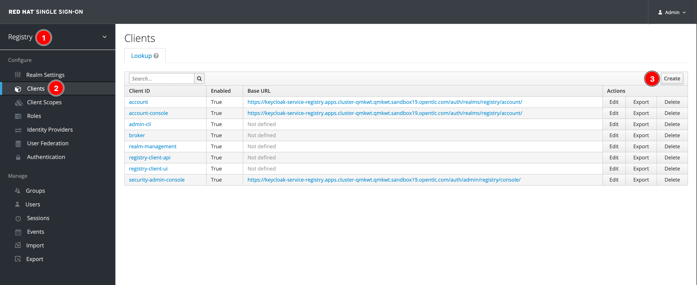
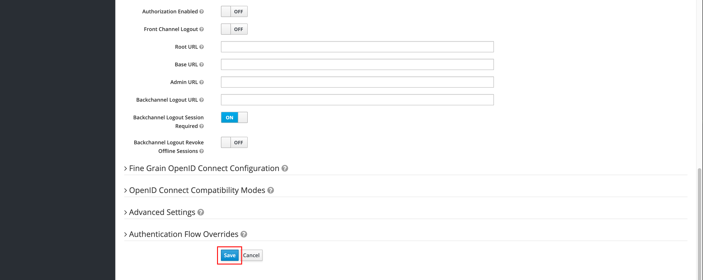

# Create SSO Client For Application

To allow client application to access Service Registry secured by SSO, a SSO client ID and secret should be given to the client application so it can use the given client ID and secret for authentication when it calls Service Registry APIs. Also, the client ID and secret will be used to configure Kafka Producer and Consumer when the the client application wants to access Service Registry.

Following these steps to create a new SSO client:

1. Login to SSO web console with admin user.

2. Select the **Registry** realm (or the ream you created in [this section](../security/create-registry-realm.md)), then select **Clients** menu, and then click **Create** button.

    

3. Enter **Client ID** value as you need, then click **Save** button.

    

4. Change **Access Type** to `confidential`, turn off **Standard Flow Enabled** and **Direct Access Grants Enabled** options. And turn on **Service Accounts Enabled** option to enable OAuth 2.0 Client Credentials flow only.

    Note. You can enable others flows as you need. But for demostration purpose, only **Service Accounts Enabled** option is enough.

    

5. Scroll down to bottom then click **Save** button.

    

6. Go to **Credentials** tab, you should be able to see secret value. This will be given to client application along with the client ID.

    
