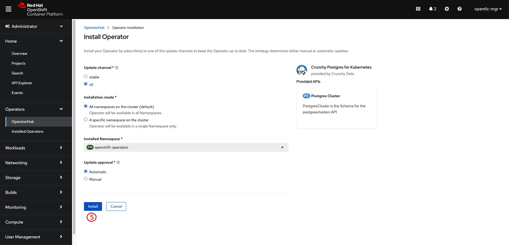

# Installing Crunchy Postgres for Kubernetes operator from the OpenShift OperatorHub

1. Go to **Operators** -> **OperatorHub** menu. Enter `postgres` into the search box, all relavent operators will show up on the screen. Then click on **Crunchy Postgres for Kubernetes operator**.

   

2. A panel with details of the operator will show up on the right. Then click **Install** button.

   

3. You can leave all options as default or change them if needed i.e. install the operator to the project you've created earlier. Then click **Install** button.

   

4. Wait until the operator gets installed successfully before proceeding to next steps.

   

   
