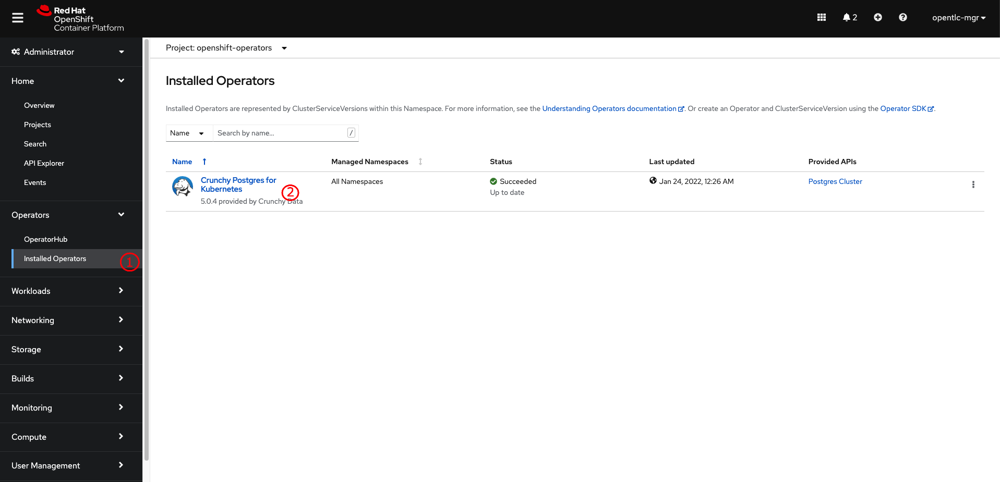
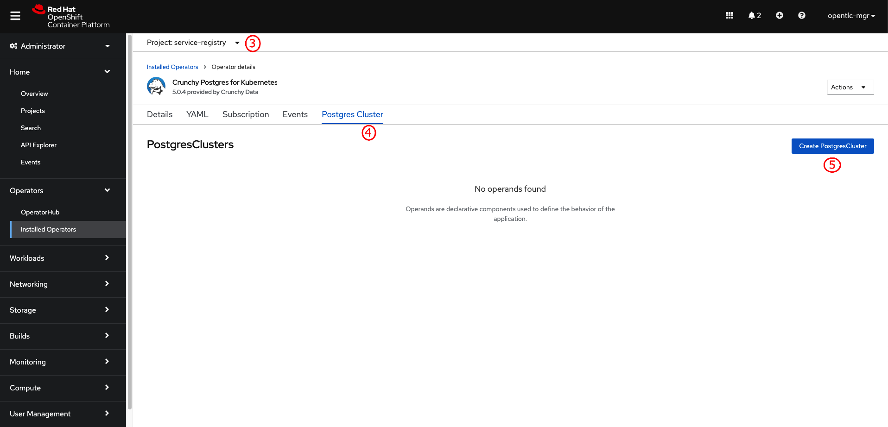
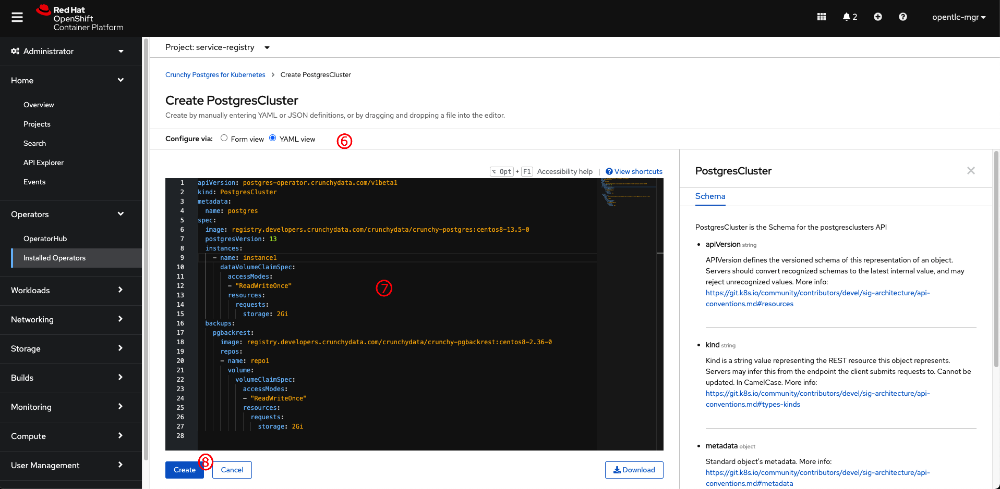
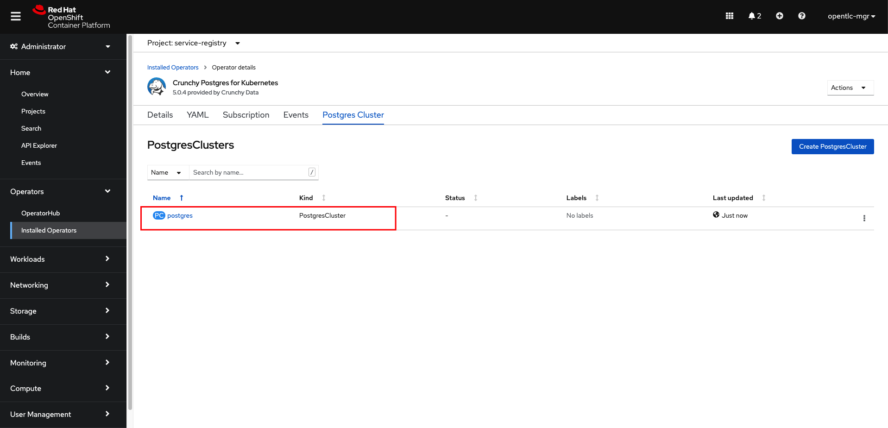
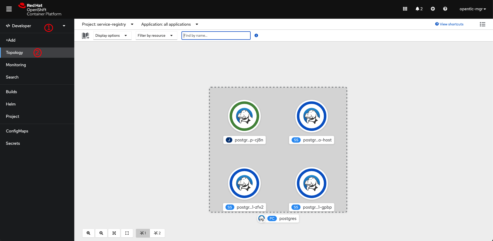
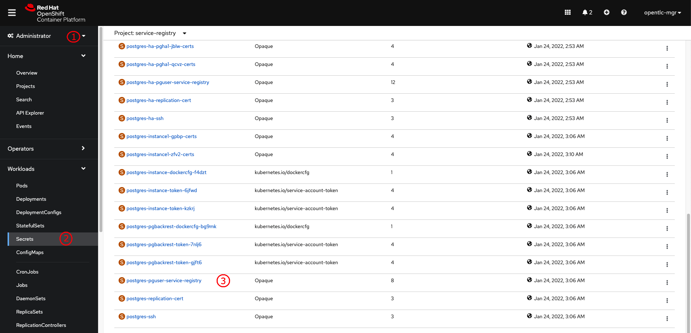
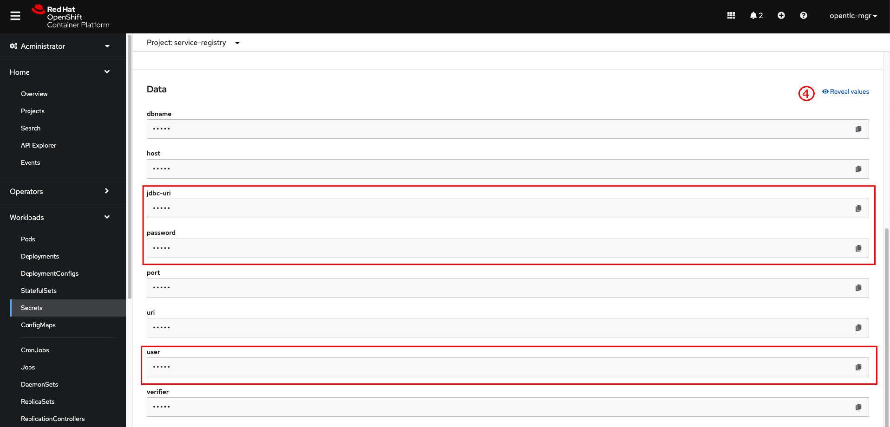

# Deploying PostgreSQL database

1. Go to **Operators** -> **Installed Operators** menu, then select **Crunchy Postgres for Kubernetes**.

   

2. Select the project you've created earlier then click on **Postgres Cluster** tab, and then click on **Create PostgresCluster** button.

   

3. Switch to **YAML view**, then copy all content in [postgres.yml](../../manifest/postgres.yml) (simple cluster) or [postgres-ha.yml](../../manifest/postgres-ha.yml) (HA and connections pooling cluster) file to the editor. Then click on **Create** button. The operator will create a PostgreSQL database cluster for you.

   

   

4. Switch to Developer perspective, then go to **Topology** menu to verify that the database cluster is up and running.

   

5. Switch to Administrator perspective, then go to **Workloads** -> **Secrets** menu. Then look for the `postgres-pguser-service-registry` secret object and click on it.

   

6. Scroll down a bit and click on **Reveal values** link to see actual values in the secret object then note the **jdbc-uri**, **user**, and **password**. This will be used when deploying Service Registry.

   
