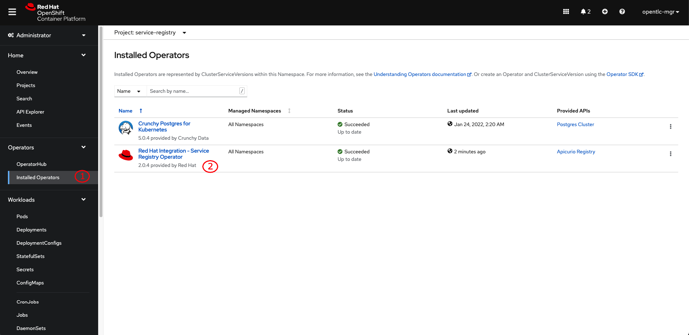
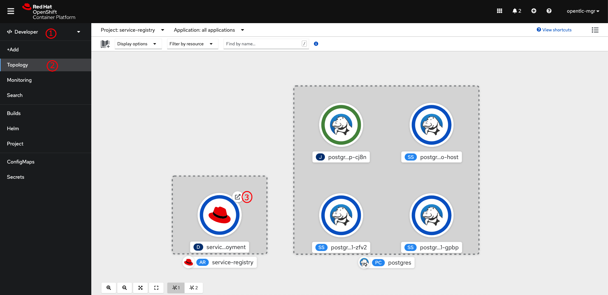
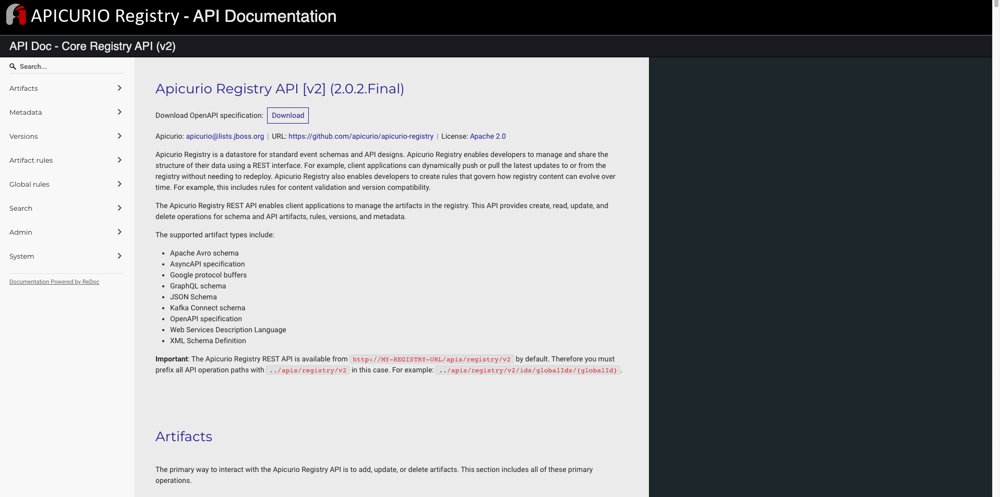

# Configuring Service Registry with PostgreSQL database storage

1. Go to **Operators** -> **Installed Operators** menu, then select **Red Hat Integration - Service Registry Operator**.

   

2. Select the project you've created earlier then click on **Apicurio Registry** tab, and then click on **Create ApicurioRegistry** button.

   

3. Switch to **YAML view**, then copy all content in [apicurio.yml](manifest/apicurio.yml) file to the editor and update **username**, **password**, and **url** from the secret. Then click on **Create** button. The operator will deploy Service Registry for you.

   

   

   You can also customize URL of the Service Registry by adding a `host` element under the `deployment` element like the snippet below. The URL will be used to configure Route object.

   ```yaml
   spec:
      configuration:
         persistence: sql
         sql:
            ....
            ....
      deployment:
         host: service-registry.example.com
         replicas: 1
   ```

4. Switch to Developer perspective, then go to **Topology** menu. You should be able to see the Service Registry pod. Click on the arrow icon to open Service Registry web console.

   

   

5. You can now start using the Service Registry via web console. However, Service Registry also can be interacted with using REST API. You can see the OpenAPI/Swagger specification by changing the URL to `/apis` as following screenshot.

   

   
