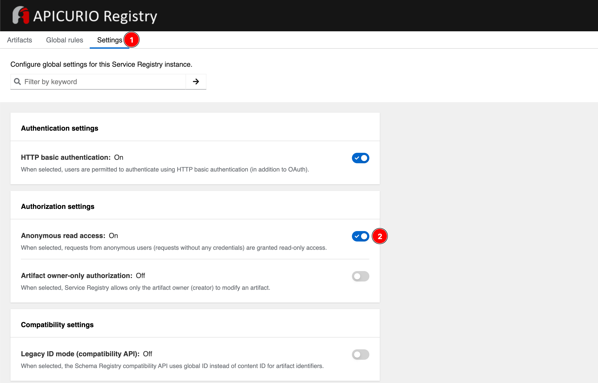

# Enable Anonymous Read Access

You can configure Service Registry to grant read-only access to requests
from anonymous users without any credentials. This setting is
useful if you want to use this instance to publish schemas or APIs
externally or in cases where authentication is not really needed for read-only access.

To enable Anonymous read access, login to Service Registry web console with administrator privilege i.e. `registry-admin` account you've created in [this section](create-registry-realm.md). Go to **Settings** tab, then enable the **Anonymous read access** option.

