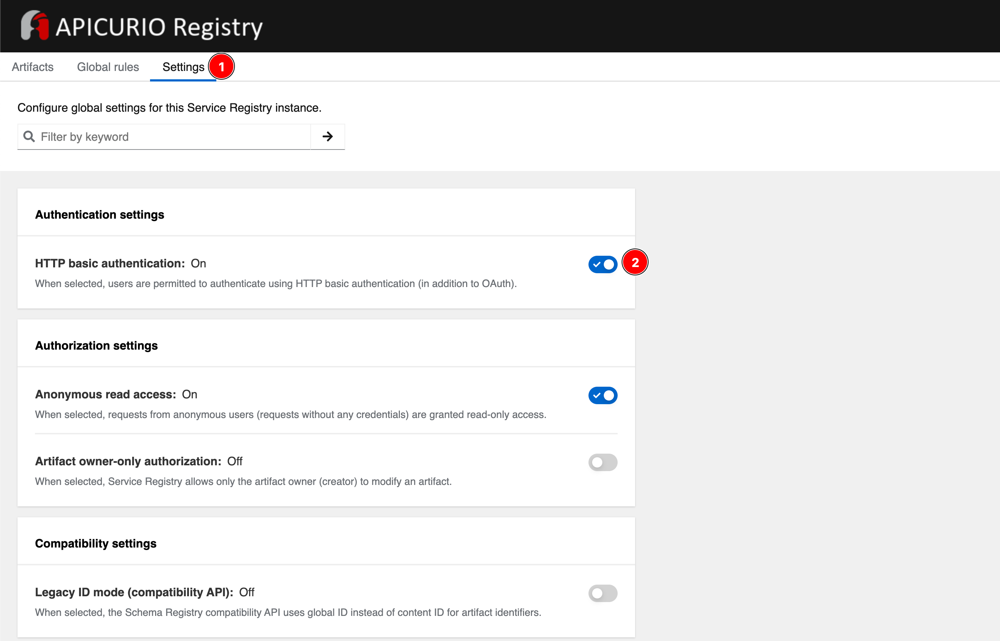

# Enable HTTP Basic Authentication

By default, Service Registry supports authentication using OpenID Connect. Users (or API clients) must obtain an access token to make authenticated calls to the Service Registry REST API. However, because some tools do not support OpenID Connect, you can also configure Service Registry to support HTTP basic authentication.

To enable HTTP basic authentication, login to Service Registry web console with administrator privilege i.e. `registry-admin` account you've created in [this section](create-registry-realm.md). Go to **Settings** tab, then enable the **HTTP basic authentication** option.

