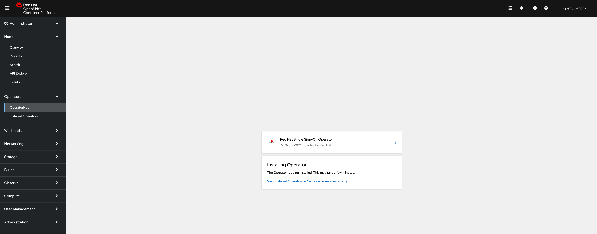
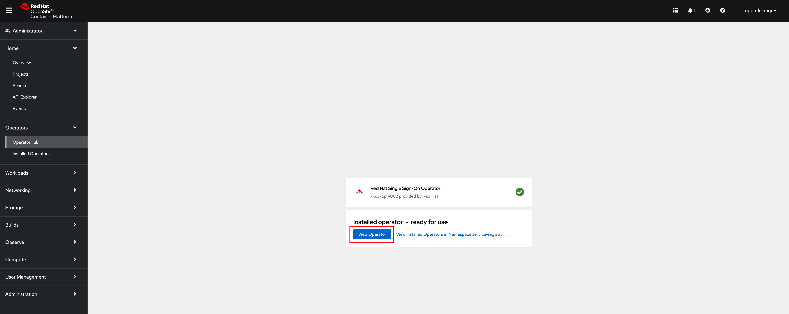
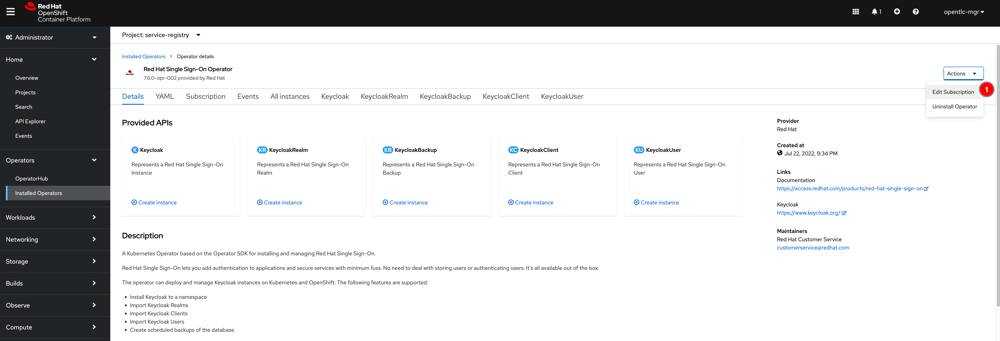
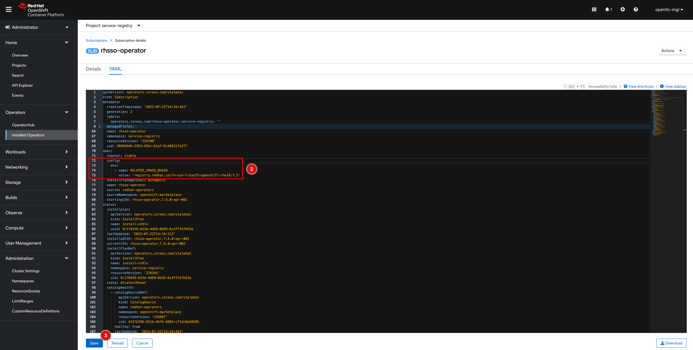

# Installing Red Hat Single Sign-On Operator from the OpenShift OperatorHub

1. Switch to **Administrator** view then go to **Operators** -> **OperatorHub** menu. Enter `sso` into the search box, the **Red Hat Single Sign-On Operator** will show up on the screen. Then click on it.

   

2. A panel with details of the operator will show up on the right. Then click **Install** button.

   

3. You can leave all options as default or change them if needed i.e. install the operator to the project you've created earlier. Then click **Install** button.

   

4. Wait until the operator gets installed successfully then click on **View Operator** button.
   
   

5. Click on **Action -> Edit Subscription** menu to edit SSO subscription.

   

6. Insert this snippet under the `spec` section to configure SSO Operator to use Red Hat Single Sign-On 7.5 instead of 7.6. Then Click on **Save** button.

   ```yaml
   config:
     env:
     - name: RELATED_IMAGE_RHSSO
       value: 'registry.redhat.io/rh-sso-7/sso75-openshift-rhel8:7.5'
   ```

   

   **Note.** The reason we have to downgrade the version is becasue `'redirect_uri'` parameter used for logout is no longer supported in version 7.6 and the application has to change to use the `'post_logout_redirect_uri'` with `'id_token_hint'` parameters instead. However, the current version of Service Registry (to be precise, Apicurio) still uses the `'redirect_uri'` parameter. Even though you can enable backwards compatibility `'legacy-logout-redirect-uri'` option of OIDC login protocol in the Red Hat SSO server (Keycloak) configuration but the configuration attribute in Keycloak CRD is experimental feature and may be changed in the future with or without notice.
