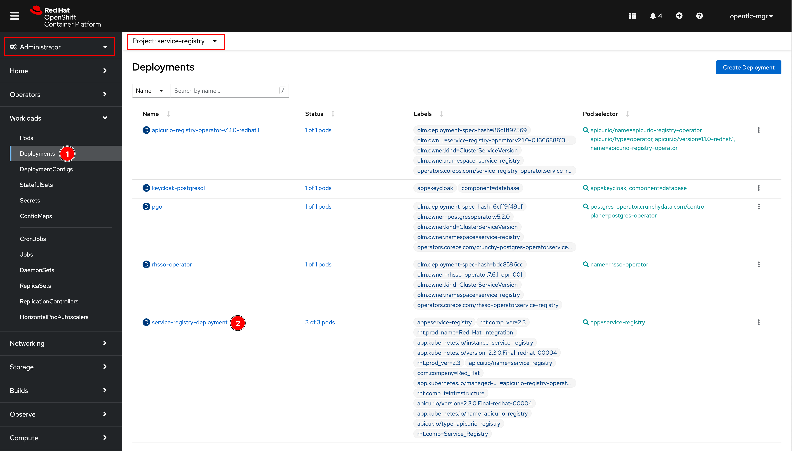
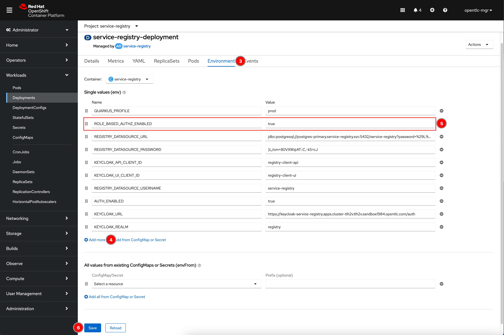
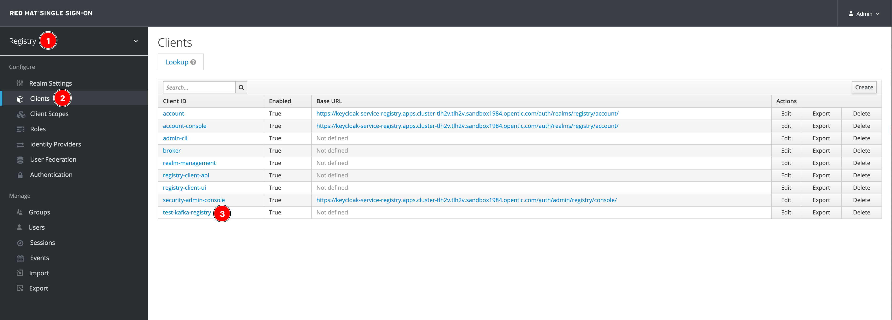
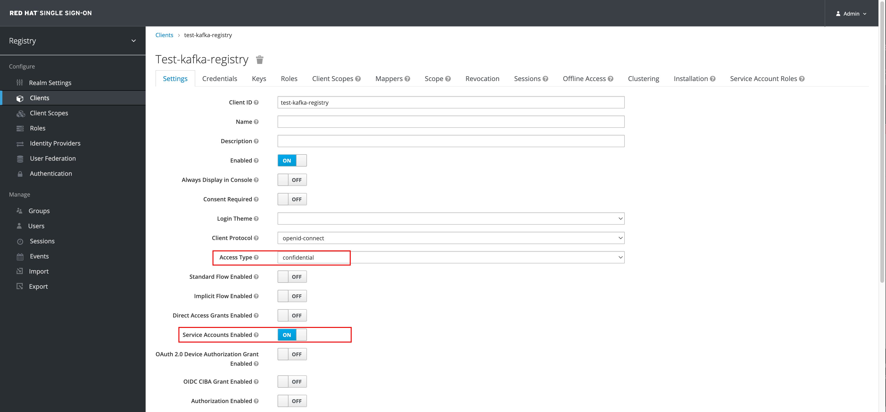
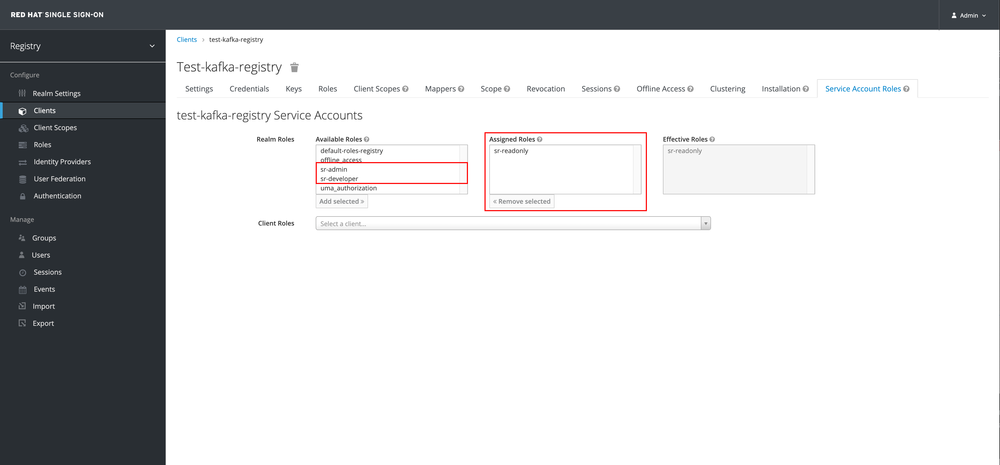
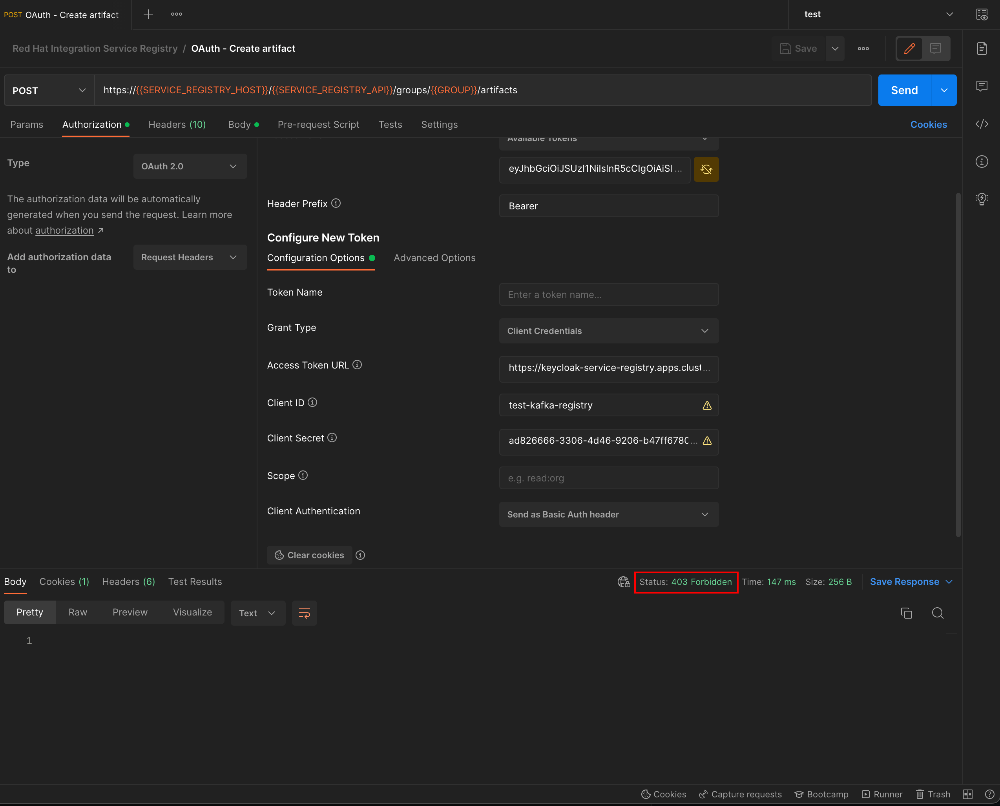
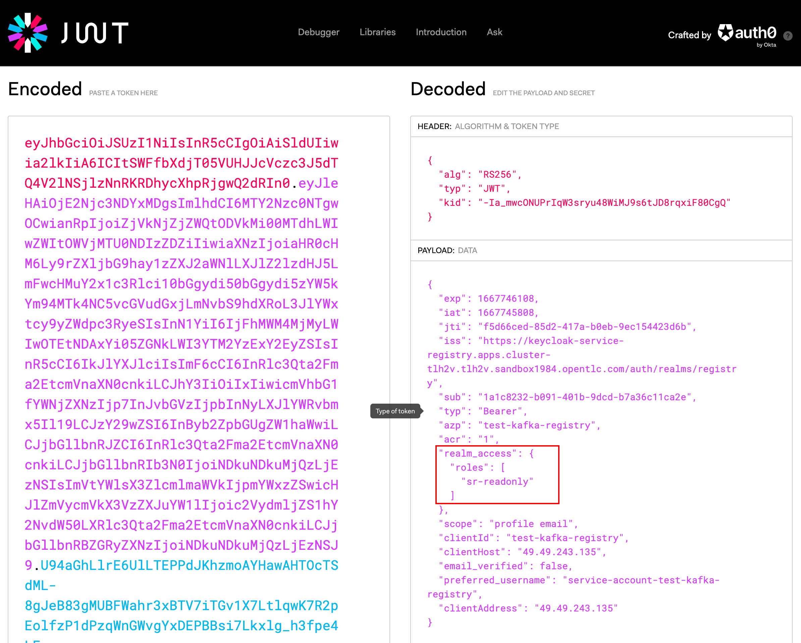

# Enable Service Registry Role-Based Authorization

## Service Registry Configuration

1. Open OpenShift web console, switch to **Administrator** perspective, and make sure you've selected `service-registry` project (or the project you've install Service Registry). Select **Workloads -> Deployments** menu, then click on `service-registry-deployment` link.

    

2. Go to **Environment** tab, click **Add more** to add a new environment variable. Enter `ROLE_BASED_AUTHZ_ENABLED` as a name and `true` as its value, then click **Save** button.

    

## Configuring Keycloak client

1. Open SSO web console, select **Registry** realm (or the realm you used for Service Registry). Select **Clients** menu then click on the client you need to configure.

    

2. Make sure the **Access Type** is `confidential` and **Service Accounts Enabled** option is `ON`

    

3. Go to **Service Account Roles** tab and assign one of valid roles (`sr-admin`, `sr-developer`, `sr-readonly`) for the client.

    

## Testing

1. Use Postman to get a token from Red Hat SSO. Then try to call the API that's not allowed for the current role assigned to client, in this case, client with `sr-readonly` role is not allowed to create artefact. The API call should be failed as a screenshot below for example.

    

2. You can optionally go to [jwt.io](https://jwt.io/) website and decode the token returned from SSO. You'll see the `roles` contains only the role you assgined for the client.

    

## References

- [Service Registry role-based authorization](https://access.redhat.com/documentation/en-us/red_hat_integration/2022.q3/html/installing_and_deploying_service_registry_on_openshift/securing-the-registry#registry-security-rbac-enabled)

- [Managing Service Registry environment variables](https://access.redhat.com/documentation/en-us/red_hat_integration/2022.q3/html/installing_and_deploying_service_registry_on_openshift/managing-the-registry#manage-registry-environment-variables)
