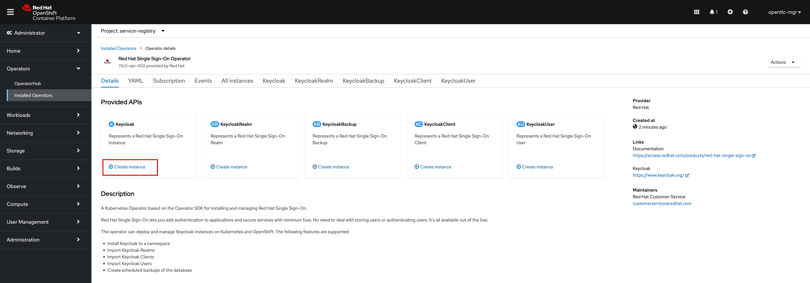

# Deploying Red Hat Single Sign-On (Keycloak)

1. Click on **Create instance** link in the **Keycloak** widget.

   

2. Switch to **YAML view** then copy the content from [keycloak-internal-db.yaml](manifest/keycloak-internal-db.yaml) file and paste into the editor. And then click on **Create** button.

   

3. A new Keycloak instance should be shown up. Then switch back to **Developer** view.

   

4. Go to **Topology** menu and wait until Keycloak pods are up and running.

   

5. Click on the arrow icon of Keyclock pod to open Keyclock web console.

   **Note.** Copy the URL displayed in web browser for later use when configuring Service Registy.

   

   
