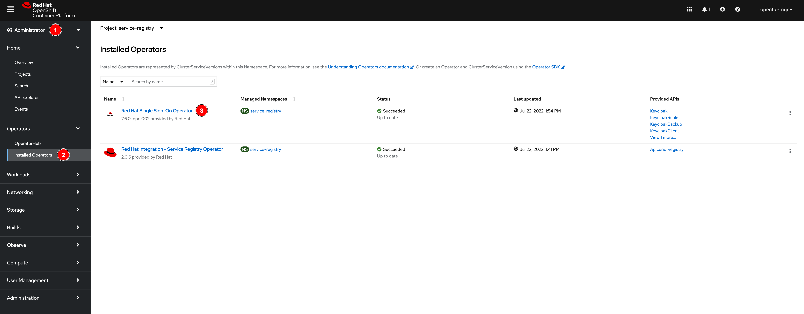
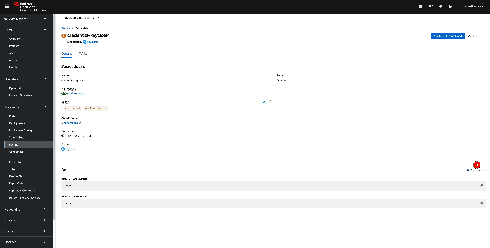

# Create Keycloak Realm for Service Registry

1. Switch to **Administrator** view then click **Installed Operators** and **Red Hat Single Sign-On Operator**, and click the Keycloak Realm tab, and then **Create KeycloakRealm** button to create a new realm.

   

   

2. Change to **YAML view** then copy the conent in [keycloak-realm.yaml](manifest/keycloak-realm.yaml) and past into the editor. Edit the realm name, redirectUris, webOrigins, username, password etc. values as you need. Then click on **Create** button.

   > You must customize this KeycloakRealm resource with values suitable for your environment if you are deploying to production i.e. **realm name, redirectUris, webOrigins, username, password** etc. You can also create and manage realms using the Red Hat Single Sign-On web console.

   

3. Go to **Workloads -> Secrets** menu, look for `credential-keycloak` secret and click on it. Then click on **Reveal values** link to see Keycloak Admin username and password.

   

   

4. Open Keycloak web console, click on **Administration Console** link. Then sign in with username and password from the previous step.

   

   

5. Select the **Registry** realm (or the realm you've just created above, then click **Users** menu, and then click **View all users** button. You should be able to see a list of users as configured in YAML in the **step 2** above.

   
