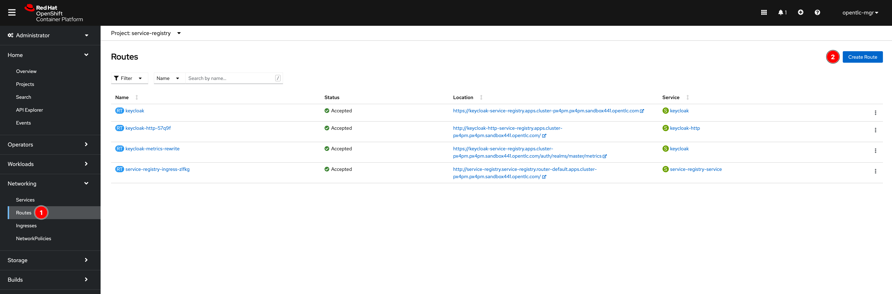
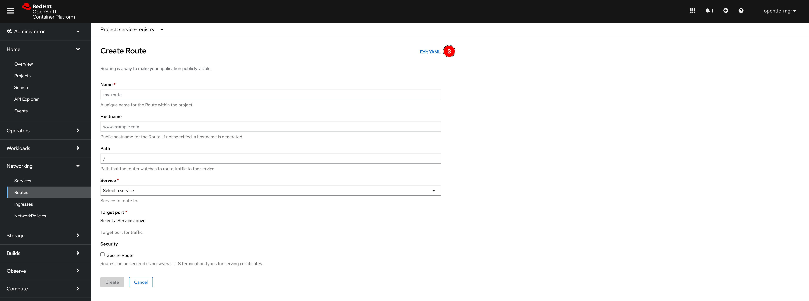
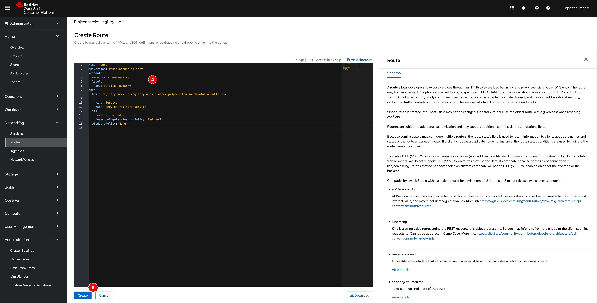
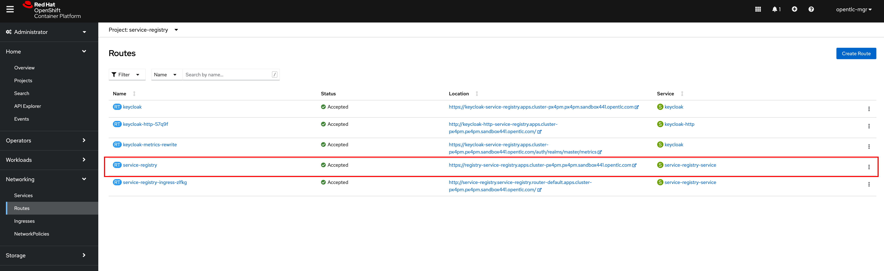

# Service Registry with HTTPS (More secure and recommended)

By default, Service Registry is installed without HTTPS configured for its Route as a screenshot below. You can create new or update existing route with HTTPS to expose an HTTPS edge-terminated route for connections from outside the OpenShift cluster.

**Note.** In case you've already configured Service Registry route with HTTPS, you can skip below steps and jump to [this section](security-8.md) directly then use the SSO's HTTPS route to configure Service Registry.

1. Go to **Networking -> Routes** then click on **Create Route** button.

   

2. Click **Edit YAML** link. Then copy the content in [service-registry-route.yaml](../../manifest/service-registry-route.yaml) file and paste into the editor. Update the `host` attribute value in this format `registry-<NAMESPACE>.apps.<CLUSTER_DOMAIN>` or whatever you need as long as it's valid DNS. Then click on **Create** button.

   

   

3. A new Service Registry Route with HTTPS should be created. Click on the URL link to open Service Registry web console.

   
