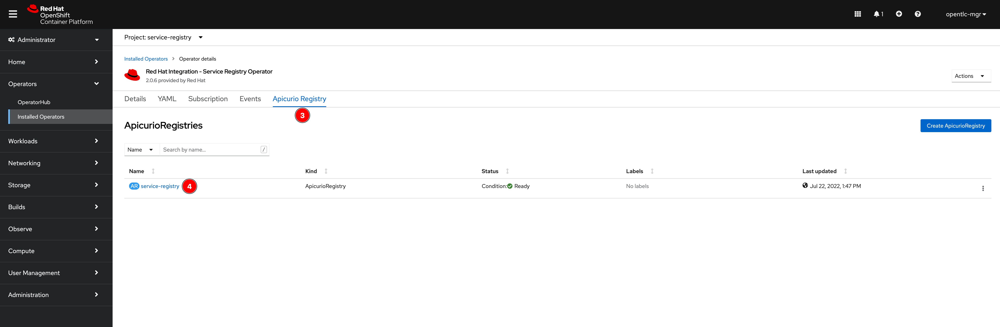
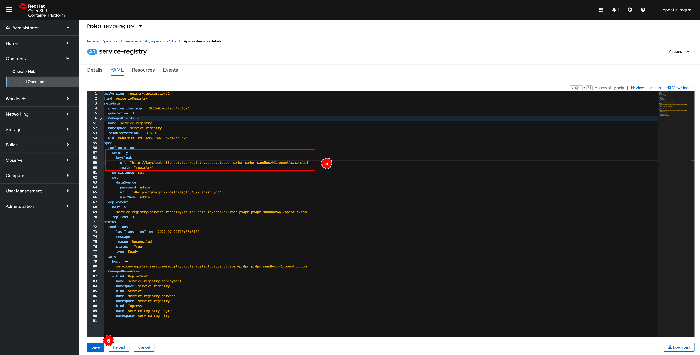
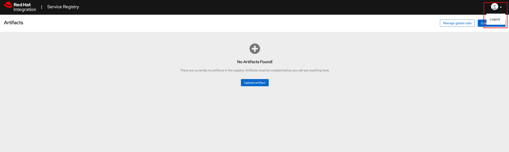

# Configuring Service Registry

1. Go to **Operators** -> **Installed Operators** menu, then select **Red Hat Integration - Service Registry Operator**. Click the **Apicurio Registry** tab, and then **service-registry** link to update Service Registry.

   

   

2. Insert this snippet under the `configuration` section as a screenshot below.

   ```yaml
   security:
      keycloak:
         url: "https://keycloak-<NAMESPACE>.apps.<CLUSTER_DOMAIN>/auth"
         realm: "registry"
   ```

   Make sure you have edit the `url` value to be the same as Keycloak HTTP route (as you configured in `Ingress` in [this section](security-7.md)) or HTTPS route you've noted in the **step 5** in [this section](security-3.md).

   Also update the `realm` attribute value as well if you changed to something else when you created a realm in the **step 2** in [this section](security-4.md).

   

3. Wait for a few minutes, the Service Registry Operator will rollout new pods with the configs. Then open the Service Registry web console URL, you will be directed to login page via Red Hat Single Sign-On.

   Enter username and password configured in YAML when you created KeycloakRealm in [this section](security-4.md) for login.

   

   

4. You should be able to log in to Service Registry web console also log out via user icon at the top right corner.

   
