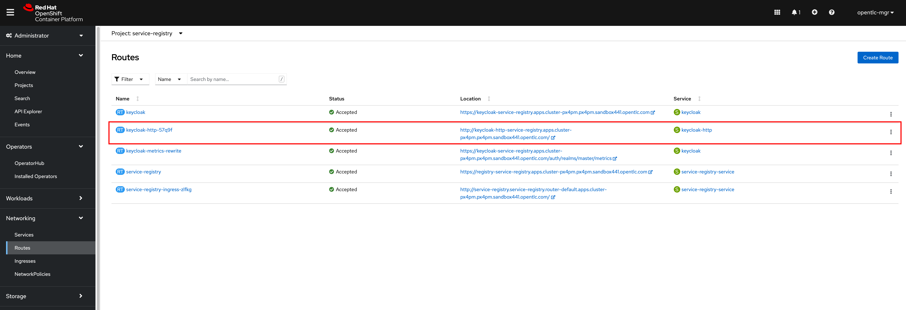

# Service Registry without HTTPS (Possible but less secure)

By default, Service Registry is installed without HTTPS configured for its Route as a screenshot below. You can **OPTIONALLY** create new or update existing route with HTTPS following the steps in [this section](service-registry-https.md).

However, if you really don't want to enable HTTPS for Service Registry then you need to create an additional `Service` and `Ingress` without HTTPS configured for Red Hat SSO/Keycloak as well so Service Registry can talk to Keycloak via HTTP protocol. Follow these steps to create `Service` and `Ingress` for Keycloak.

- To create a `Service`, go to **Networking -> Services** menu then click on **Create Service** button. Copy the content in [keycloak-service.yaml](../../manifest/keycloak-service.yaml) file and paste into the editor then click on **Create** button.

   

   

- To create an `Ingress`, go to **Networking -> Ingresses** menu then click on **Create Ingress** button. Copy the content in [keycloak-ingress.yaml](../../manifest/keycloak-ingress.yaml) file and paste into the editor, then edit the `host` attribute value with this format `keycloak-http-<NAMESPACE>.apps.<CLUSTER_DOMAIN>` i.e. `http://keycloak-http-service-registry.apps.cluster-px4pm.opentlc.com` and then click on **Create** button.

   

   

- Go to **Networking -> Routes** menu you should be able to see a new HTTP Keycloak Route is automatically created. Then click on the URL link to open Red Hat SSO web console.

   **Note.** Copy the URL displayed in web browser for later use when [configuring Service Registy](service-registry-configuration.md).

   
