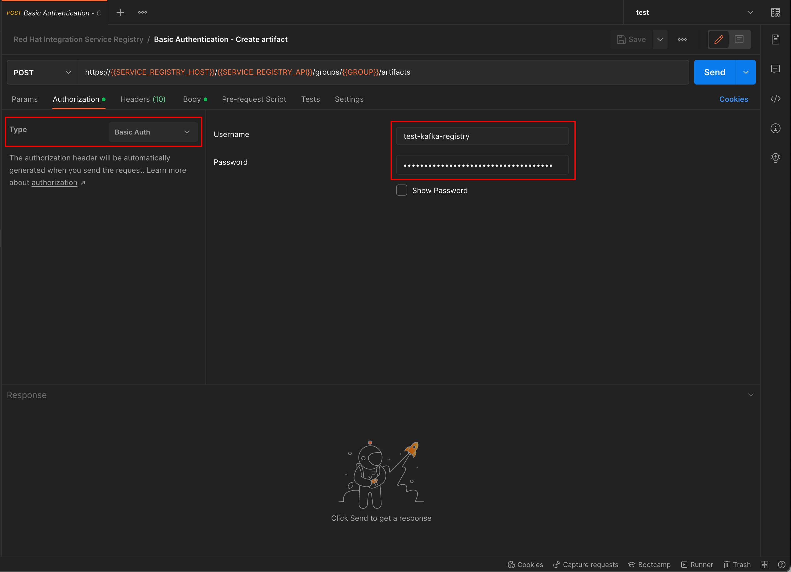
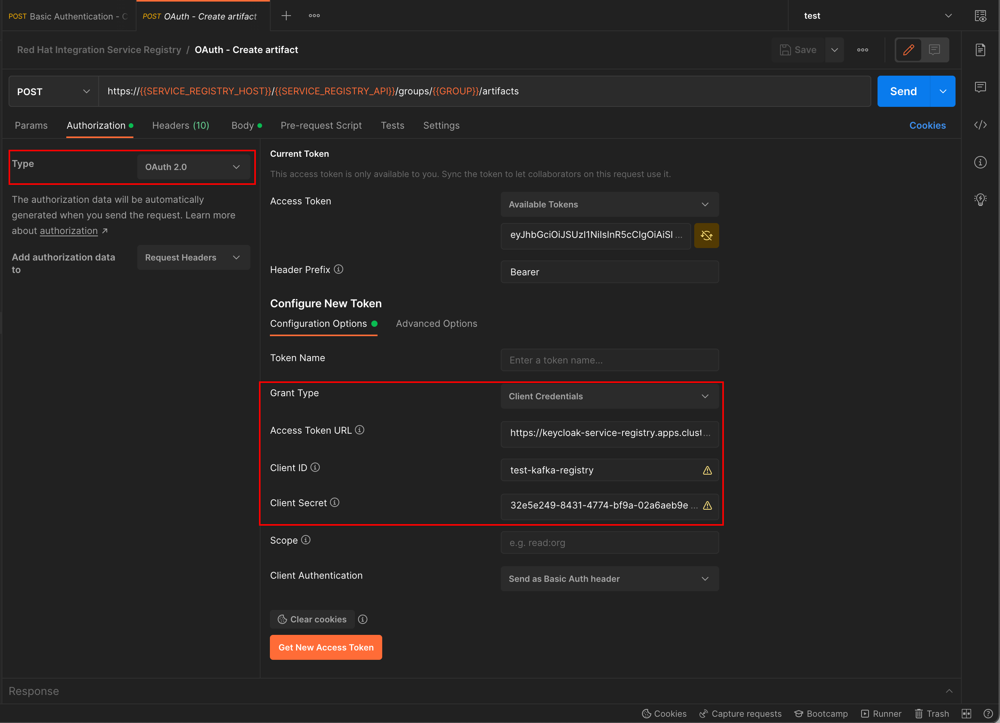

# Testing Secure Service Registry API

OAuth 2.0 has a bunch of [Grant Types](https://www.rfc-editor.org/rfc/rfc6749#section-1.3) for different use cases. OpenID Connect and OAuth 2.0 provide following 4 major kinds of grant types which can be used with Red Hat SSO (Keycloak). While configuring each client, Keycloak provides options for enabling each of the above mentioned grant types as following table:

| **Grant Type**                          | **Keycloak Option**              |
|-------------------------------------|------------------------------|
| Authorization Code                  | Standard Flow Enabled        |
| Client Credentials                  | Service Accounts Enabled     |
| Resource Owner Password Credentials | Direct Access Grants Enabled |
| Implicit                            | Implicit Flow Enabled        |

Testing Service Registry API secured by Red Hat SSO is obviously that client must authenticate to Red Hat SSO (in case of OAuth) or Service Registry (in case of Basic Auth).

This section will show you how to call Service Registry API secured with OAuth (Client Credentials Grant Type. See [create client with Client Credentials Grant Type](../client/create-sso-client.md)) and Basic Auth using Postman. What you need to do in addition to calling unsecure API is configure the **Authorization** tab.

## Call API secured with Basic Authentication

To call Service Registry APIs secured with Basic Authentication, you have to configure the **Authorization** tab as following:

- **Type:** `Basic Auth`
- **Username:** Client ID in Red Hat SSO
- **Password:** Client secret

## Call API secured with OAuth (Client Credentials Grant Type)

To call Service Registry APIs secured with OAuth, you have to configure the **Authorization** tab as following:

- **Type:** `OAuth 2.0`
- **Grant Type:** `Client Credentials`
- **Access Token URL:** Keycloak access token URL in this format: `https://<KEYCLOAK_HOST>/auth/realms/<REALM>/registry/protocol/openid-connect/token`. For example, `https://keycloak.example.com/auth/realms/registry/protocol/openid-connect/token`
- **Client ID:** Client ID in Red Hat SSO
- **Client Secret:** Client secret

