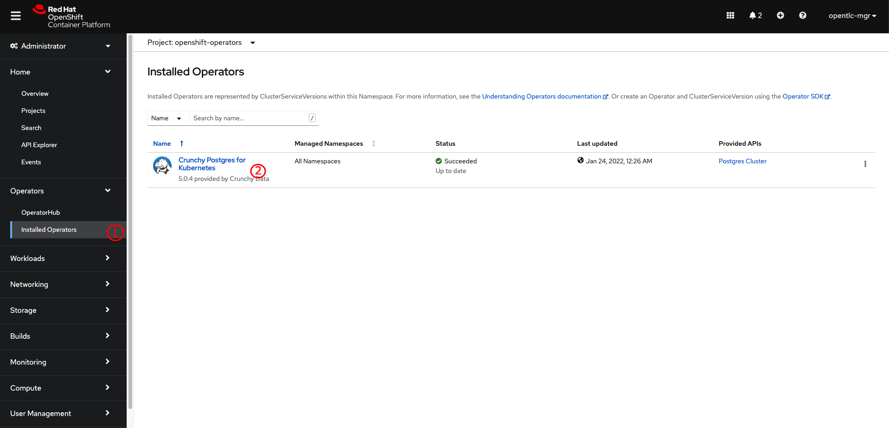
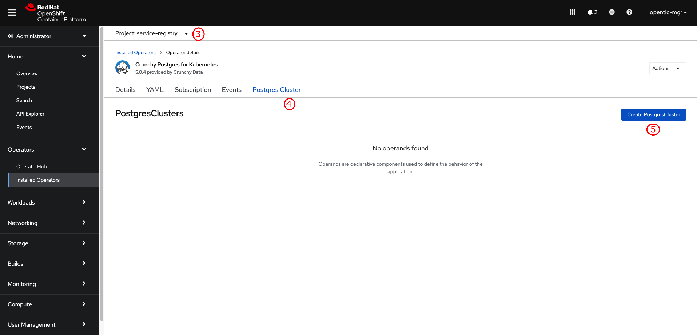
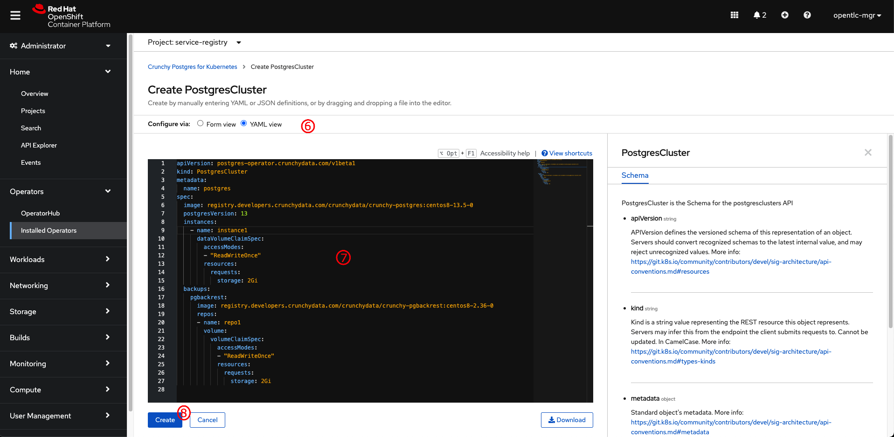
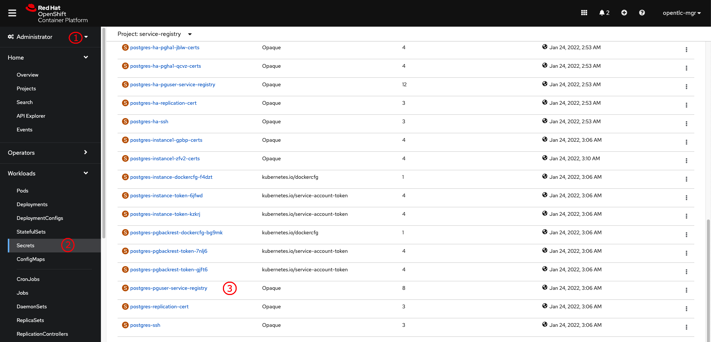
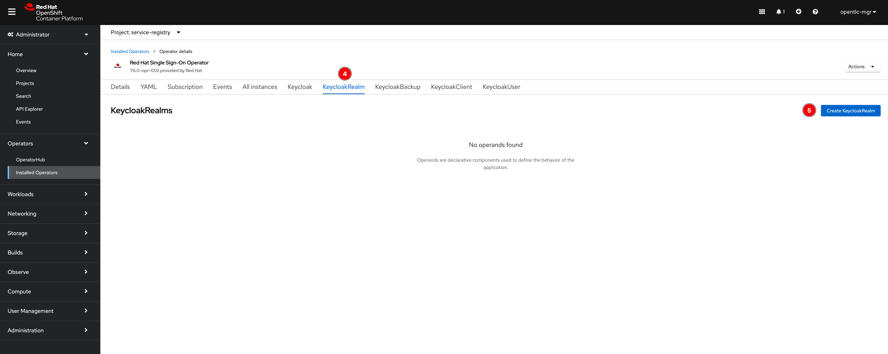
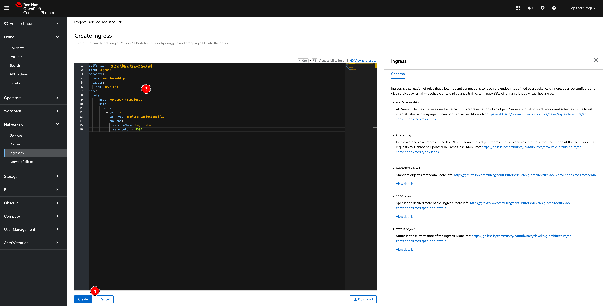
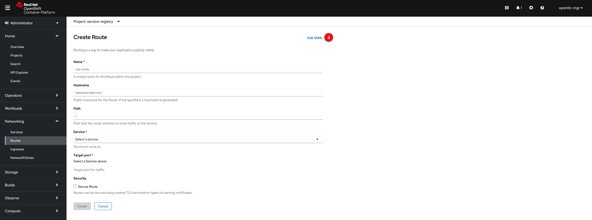

# Red Hat® Integration - Service Registry installation guide

**Red Hat® Integration - Service Registry** is a service that provides an API and schema registry for applications i.e. microservices. Service Registry makes it easy for development teams to publish, discover, and reuse APIs and schemas.

Well-defined API and schema definitions are essential to delivering robust microservice and event streaming architectures. Development teams can use a registry to manage these artifacts in various formats, including OpenAPI, AsyncAPI, Apache Avro, Protocol Buffers, and more. Data producers and consumers can then use the artifacts to validate and serialize or deserialize data.

This installation guide will show you how to install **Red Hat® Integration - Service Registry** on [Red Hat® OpenShift Container Platform](https://www.redhat.com/en/technologies/cloud-computing/openshift/container-platform) **4.8** and use PostgreSQL as a storage for the Service Registry. Though, [Red Hat® AMQ Streams](https://www.redhat.com/en/resources/amq-streams-datasheet) can also be used as a storage as well. Please check [offcial document](https://access.redhat.com/documentation/en-us/red_hat_integration/2021.q3/html/installing_and_deploying_service_registry_on_openshift/index) for more details.

- [Red Hat® Integration - Service Registry installation guide](#red-hat-integration---service-registry-installation-guide)
  - [Setting up a project](#setting-up-a-project)
  - [PostgreSQL database deployment](#postgresql-database-deployment)
    - [Installing Crunchy Postgres for Kubernetes operator from the OpenShift OperatorHub](#installing-crunchy-postgres-for-kubernetes-operator-from-the-openshift-operatorhub)
    - [Deploying PostgreSQL database](#deploying-postgresql-database)
  - [Red Hat Integration - Service Registry deployment](#red-hat-integration---service-registry-deployment)
    - [Installing Service Registry from the OpenShift OperatorHub](#installing-service-registry-from-the-openshift-operatorhub)
    - [Configuring Service Registry with PostgreSQL database storage](#configuring-service-registry-with-postgresql-database-storage)
  - [Testing Service Registry](#testing-service-registry)
    - [REST API testing using Postman](#rest-api-testing-using-postman)
    - [Performance testing using hey](#performance-testing-using-hey)
  - [Secure Service Registry using Red Hat Single Sign-On](#secure-service-registry-using-red-hat-single-sign-on)
    - [Installing Red Hat Single Sign-On Operator from the OpenShift OperatorHub](#installing-red-hat-single-sign-on-operator-from-the-openshift-operatorhub)
    - [Deploying Red Hat Single Sign-On (Keycloak)](#deploying-red-hat-single-sign-on-keycloak)
    - [Create Keycloak Realm for Service Registry](#create-keycloak-realm-for-service-registry)
    - [Configuring Service Registry authentication and authorization with Red Hat Single Sign-On](#configuring-service-registry-authentication-and-authorization-with-red-hat-single-sign-on)
      - [Service Registry without HTTPS (Possible but less secure)](#service-registry-without-https-possible-but-less-secure)
      - [Service Registry with HTTPS (More secure and recommended)](#service-registry-with-https-more-secure-and-recommended)
      - [Configuring Service Registry](#configuring-service-registry)

## Setting up a project

1. Log in to OpenShift web console using an account with cluster administrator privileges.

2. Go to **Projects** menu, then click on **Create Project** button.

   

3. Enter a project name, then click on **Create** button.

   

## PostgreSQL database deployment

We're going to use PostgreSQL database as a storage for Service Registry so we need to setup the database first and make sure it's ready to use. There are plenty of options for PostgreSQL operators or containers that can be installed on OpenShift. You can use either commercial or community version that suites your environment and requirement. This guide will show you how to deploy PostgreSQL database using [Crunchy Postgres for Kubernetes operator](https://github.com/CrunchyData/postgres-operator).

**_NOTE:_** You can use existing PostgreSQL database (if exists) or run your own PostgreSQL containers cluster without using the operator. Or you can use differnt operator from marketplace or opensource community.

### Installing Crunchy Postgres for Kubernetes operator from the OpenShift OperatorHub

1. Go to **Operators** -> **OperatorHub** menu. Enter `postgres` into the search box, all relavent operators will show up on the screen. Then click on **Crunchy Postgres for Kubernetes operator**.

   

2. A panel with details of the operator will show up on the right. Then click **Install** button.

   

3. You can leave all options as default or change them if needed i.e. install the operator to the project you've created earlier. Then click **Install** button.

   

4. Wait until the operator gets installed successfully before proceeding to next steps.

   

   

### Deploying PostgreSQL database

1. Go to **Operators** -> **Installed Operators** menu, then select **Crunchy Postgres for Kubernetes**.

   

2. Select the project you've created earlier then click on **Postgres Cluster** tab, and then click on **Create PostgresCluster** button.

   

3. Switch to **YAML view**, then copy all content in [postgres.yml](manifest/postgres.yml) (simple cluster) or [postgres-ha.yml](manifest/postgres-ha.yml) (HA and connections pooling cluster) file to the editor. Then click on **Create** button. The operator will create a PostgreSQL database cluster for you.

   

   

4. Switch to Developer perspective, then go to **Topology** menu to verify that the database cluster is up and running.

   

5. Switch to Administrator perspective, then go to **Workloads** -> **Secrets** menu. Then look for the `postgres-pguser-service-registry` secret object and click on it.

   

6. Scroll down a bit and click on **Reveal values** link to see actual values in the secret object then note the **jdbc-uri**, **user**, and **password**. This will be used when deploying Service Registry.

   

## Red Hat Integration - Service Registry deployment

### Installing Service Registry from the OpenShift OperatorHub

1. Go to **Operators** -> **OperatorHub** menu. Enter `service registry` into the search box, the **Red Hat Integration - Service Registry Operator** will show up on the screen. Then click on it.

   

2. A panel with details of the operator will show up on the right. Then click **Install** button.

   

3. You can leave all options as default or change them if needed i.e. install the operator to the project you've created earlier. Then click **Install** button.

   

4. Wait until the operator gets installed successfully before proceeding to next steps.

   

### Configuring Service Registry with PostgreSQL database storage

1. Go to **Operators** -> **Installed Operators** menu, then select **Red Hat Integration - Service Registry Operator**.

   

2. Select the project you've created earlier then click on **Apicurio Registry** tab, and then click on **Create ApicurioRegistry** button.

   

3. Switch to **YAML view**, then copy all content in [apicurio.yml](manifest/apicurio.yml) file to the editor and update **username**, **password**, and **url** from the secret. Then click on **Create** button. The operator will deploy Service Registry for you.

   

   

4. Switch to Developer perspective, then go to **Topology** menu. You should be able to see the Service Registry pod. Click on the arrow icon to open Service Registry web console.

   

   

5. You can now start using the Service Registry via web console. However, Service Registry also can be interacted with using REST API. You can see the OpenAPI/Swagger specification by changing the URL to `/apis` as following screenshot.

   

   

## Testing Service Registry

Once you've finished setting up the Service Registry, you might need to run a few tests/checks to make sure that everything is working as expected. Service Registry can be interacted with via 3 main channels/methods.

1. Web console
2. REST API
3. Client API (Programming)

You've already seen how to access the web console in the previous steps. Now, we'll have a look at how to interact with the Service Registry via REST APIs also a quick example of performance testing.

### REST API testing using Postman

This guide has provided a [Postman](https://www.postman.com/) collection with some example of requests to interact with the Service Registry via REST API calls. You can import the [Postman collection](postman/service-registry.postman_collection.json) and [Postman environment](postman/service-registry.test.postman_environment.json) files to Postman application as explained in the Postman official guide [here](https://learning.postman.com/docs/getting-started/importing-and-exporting-data/).


Postman collection uses environment to store some variables i.e. hostname, API, group etc. which are used by each request in the collection. So, once you've imported the collection and environment files, you need to update the `SERVICE_REGISTRY_HOST` and `GROUP` variables in the Postman environment as a screenshot below before testing the Service Registry.


### Performance testing using hey

[**hey**](https://github.com/rakyll/hey) is a tiny program that sends some load to a web application. You can use it to run simple performance testing. Please check hey [usage manual](https://github.com/rakyll/hey#usage) for command line options.

- Setup environment variables.

  ```sh
  export SERVICE_REGISTRY_BASE_URL="http://service-registry-service.test.svc:8080"
  export SCHEMA_GROUP="performance-test"
  ```

  **_NOTE:_** The base URL in your cluster might be different than this. Also, if you're running `hey` outside the cluster then the base URL should be the same as Service Registry's route.

- Testing create artifact API.

  - Create a payload i.e. [json-schema.json](manifest/json-schema.json) file to be used for testing.

  - Run `hey` command to execute the test.

    ```sh
    ./hey -n 1000 -c 50 \
    -m POST \
    -D "json-schema.json" \
    -T "application/json" \
    -H "X-Registry-ArtifactType: JSON" \
    $SERVICE_REGISTRY_BASE_URL/apis/registry/v2/groups/$SCHEMA_GROUP/artifacts
    ```

    Sample output:

    ```text
    Summary:
    Total:        2.4149 secs
    Slowest:      0.2732 secs
    Fastest:      0.0126 secs
    Average:      0.1107 secs
    Requests/sec: 414.0978

    Total data:   261000 bytes
    Size/request: 261 bytes

    Response time histogram:
    0.013 [1]     |
    0.039 [68]    |■■■■■
    0.065 [29]    |■■
    0.091 [122]   |■■■■■■■■■
    0.117 [534]   |■■■■■■■■■■■■■■■■■■■■■■■■■■■■■■■■■■■■■■■■
    0.143 [58]    |■■■■
    0.169 [9]     |■
    0.195 [141]   |■■■■■■■■■■■
    0.221 [35]    |■■■
    0.247 [2]     |
    0.273 [1]     |


    Latency distribution:
    10% in 0.0668 secs
    25% in 0.0932 secs
    50% in 0.1032 secs
    75% in 0.1164 secs
    90% in 0.1834 secs
    95% in 0.1919 secs
    99% in 0.2095 secs

    Details (average, fastest, slowest):
    DNS+dialup:   0.0003 secs, 0.0126 secs, 0.2732 secs
    DNS-lookup:   0.0001 secs, 0.0000 secs, 0.0062 secs
    req write:    0.0002 secs, 0.0000 secs, 0.0115 secs
    resp wait:    0.1102 secs, 0.0125 secs, 0.2730 secs
    resp read:    0.0001 secs, 0.0000 secs, 0.0009 secs

    Status code distribution:
    [200]   1000 responses
    ```

- Testing get artifact API.

  - Grab one of schema ID from the Service Registry web console and export as an environment variable.

    ```sh
    export SCHEMA_ID="000427c8-080f-4300-9ea6-cb8aee64b922"
    ```

  - Run `hey` command to execute the test.

    ```sh
    ./hey -n 10000 -c 100 \
      -m GET $SERVICE_REGISTRY_BASE_URL/apis/registry/v2/groups/$SCHEMA_GROUP/artifacts/$SCHEMA_ID
    ```

    Sample output:

    ```text
    Summary:
    Total:         8.9206 secs
    Slowest:       0.3318 secs
    Fastest:       0.0037 secs
    Average:       0.0860 secs
    Requests/sec:  1121.0042

    Total data:    65910000 bytes
    Size/request:  6591 bytes

    Response time histogram:
    0.004 [1]      |
    0.037 [2194]   |■■■■■■■■■■■■■■■■■■
    0.069 [84]     |■
    0.102 [4878]   |■■■■■■■■■■■■■■■■■■■■■■■■■■■■■■■■■■■■■■■■
    0.135 [2018]   |■■■■■■■■■■■■■■■■■
    0.168 [9]      |
    0.201 [741]    |■■■■■■
    0.233 [61]     |■
    0.266 [7]      |
    0.299 [5]      |
    0.332 [2]      |


    Latency distribution:
    10% in 0.0127 secs
    25% in 0.0804 secs
    50% in 0.0949 secs
    75% in 0.1036 secs
    90% in 0.1146 secs
    95% in 0.1846 secs
    99% in 0.1981 secs

    Details (average, fastest, slowest):
    DNS+dialup: 0.0001 secs, 0.0037 secs, 0.3318 secs
    DNS-lookup: 0.0000 secs, 0.0000 secs, 0.0123 secs
    req write:  0.0001 secs, 0.0000 secs, 0.0639 secs
    resp wait:  0.0855 secs, 0.0036 secs, 0.3317 secs
    resp read:  0.0003 secs, 0.0000 secs, 0.0983 secs

    Status code distribution:
    [200] 10000 responses
    ```

## Secure Service Registry using Red Hat Single Sign-On

Service Registry provides authentication and authorization using Red Hat Single Sign-On based on OpenID Connect (OIDC) or HTTP basic. You can configure the required settings automatically using the Red Hat Single Sign-On Operator, or manually configure them in Red Hat Single Sign-On and Service Registry.

Service Registry provides role-based authentication and authorization for the Service Registry web console and core REST API using Red Hat Single Sign-On. Service Registry also provides content-based authorization at the schema or API level, where only the artifact creator has write access. You can also configure an HTTPS connection to Service Registry from inside or outside an OpenShift cluster.

More information please see [official document](https://access.redhat.com/documentation/en-us/red_hat_integration/2021.q3/html/installing_and_deploying_service_registry_on_openshift/securing-the-registry).

### Installing Red Hat Single Sign-On Operator from the OpenShift OperatorHub

1. Switch to **Administrator** view then go to **Operators** -> **OperatorHub** menu. Enter `sso` into the search box, the **Red Hat Single Sign-On Operator** will show up on the screen. Then click on it.

   

2. A panel with details of the operator will show up on the right. Then click **Install** button.

   

3. You can leave all options as default or change them if needed i.e. install the operator to the project you've created earlier. Then click **Install** button.

   

4. Wait until the operator gets installed successfully then click on **View Operator** button.
   
   

5. Click on **Action -> Edit Subscription** menu to edit SSO subscription.

   

6. Insert this snippet under the `spec` section to configure SSO Operator to use Red Hat Single Sign-On 7.5 instead of 7.6. Then Click on **Save** button.

   ```yaml
   config:
    env:
      - name: RELATED_IMAGE_RHSSO
        value: 'registry.redhat.io/rh-sso-7/sso75-openshift-rhel8:7.5'
   ```

   

   **Note.** The reason we have to downgrade the version is becasue `'redirect_uri'` parameter used for logout is no longer supported in version 7.6 and the application has to change to use the `'post_logout_redirect_uri'` with `'id_token_hint'` parameters instead. However, the current version of Service Registry (to be precise, Apicurio) still uses the `'redirect_uri'` parameter. Even though you can enable backwards compatibility option `'legacy-logout-redirect-uri'` of OIDC login protocol in the Red Hat SSO server (Keycloak) configuration but the configuration attribute in Keycloak CRD is experimental feature and may be changed in the future with or without notice.

### Deploying Red Hat Single Sign-On (Keycloak)

1. Click on **Create instance** link in the **Keycloak** widget.

   

2. Switch to **YAML view** then copy the content from [keycloak-internal-db.yaml](manifest/keycloak-internal-db.yaml) file and paste into the editor. And then click on **Create** button.

   

3. A new Keycloak instance should be shown up. Then switch back to **Developer** view.

   

4. Go to **Topology** menu and wait until Keycloak pods are up and running.

   

5. Click on the arrow icon of Keyclock pod to open Keyclock web console.

   **Note.** Copy the URL displayed in web browser for later use when configuring Service Registy.

   

   

### Create Keycloak Realm for Service Registry

1. Switch to **Administrator** view then click **Installed Operators** and **Red Hat Single Sign-On Operator**, and click the Keycloak Realm tab, and then **Create KeycloakRealm** button to create a new realm.

   

   

2. Change to **YAML view** then copy the conent in [keycloak-realm.yaml](manifest/keycloak-realm.yaml) and past into the editor. Edit the realm name, redirectUris, webOrigins, username, password etc. values as you need. Then click on **Create** button.

   > You must customize this KeycloakRealm resource with values suitable for your environment if you are deploying to production i.e. **realm name, redirectUris, webOrigins, username, password** etc. You can also create and manage realms using the Red Hat Single Sign-On web console.

   

3. Go to **Workloads -> Secrets** menu, look for `credential-keycloak` secret and click on it. Then click on **Reveal values** link to see Keycloak Admin username and password.

   

   

4. Open Keycloak web console, click on **Administration Console** link. Then sign in with username and password from the previous step.

   

   

5. Select the **Registry** realm (or the realm you created in [the earlier step](#create-realm)), then click **Users** menu, and then click **View all users** button. You should be able to see a list of users as configured in YAML when you [created Keycloak realm](#create-keycloak-realm-for-service-registry).

   

### Configuring Service Registry authentication and authorization with Red Hat Single Sign-On

#### Service Registry without HTTPS (Possible but less secure)

By default, Service Registry is installed without HTTPS configured for its Route as a screenshot below. You can **OPTIONALLY** create new or update existing route with HTTPS following the steps in [this section](#service-registry-with-https-more-secure-and-recommended).


However, if you really don't want to enable HTTPS for Service Registry then you need to create an additional `Service` and `Ingress` without HTTPS configured for Red Hat SSO/Keycloak as well so Service Registry can talk to Keycloak via HTTP protocol. Follow these steps to create `Service` and `Ingress` for Keycloak.

- To create a `Service`, go to **Networking -> Services** menu then click on **Create Service** button. Copy the content in [keycloak-service.yaml](manifest/keycloak-service.yaml) file and paste into the editor then click on **Create** button.

   

   

- To create an `Ingress`, go to **Networking -> Ingresses** menu then click on **Create Ingress** button. Copy the content in [keycloak-ingress.yaml](manifest/keycloak-ingress.yaml) file and paste into the editor, then edit the `host` attribute value with this format `keycloak-http-<namespace>.apps.<cluster host>` i.e. `http://keycloak-http-service-registry.apps.cluster-px4pm.opentlc.com` and then click on **Create** button.

   

   

- Go to **Networking -> Routes** menu you should be able to see a new HTTP Keycloak Route is automatically created. Then click on the URL link to open Red Hat SSO web console.

   **Note.** Copy the URL displayed in web browser for later use when configuring Service Registy.

   

#### Service Registry with HTTPS (More secure and recommended)

By default, Service Registry is installed without HTTPS configured for its Route as a screenshot below. You can create new or update existing route with HTTPS to expose an HTTPS edge-terminated route for connections from outside the OpenShift cluster.

**Note.** In case you've configured Service Registry route with HTTPS then you can use the SSO's HTTPS route to configure Service Registry directly in the next step.

1. Go to **Networking -> Routes** then click on **Create Route** button.

   

2. Click **Edit YAML** link. Then copy the content in [service-registry-route.yaml](manifest/service-registry-route.yaml) file and paste into the editor. Update the `host` attribute value in this format `registry-<namespace>.apps.<cluster host>` or whatever you need as long as it's valid DNS. Then click on **Create** button.

   

   

3. A new Service Registry Route with HTTPS should be created. Click on the URL link to open Service Registry web console.

   

#### Configuring Service Registry

1. Go to **Operators** -> **Installed Operators** menu, then select **Red Hat Integration - Service Registry Operator**. Click the **Apicurio Registry** tab, and then **service-registry** link to update Service Registry.

   

   

2. Insert this snippet under the `configuration` section as a screenshot below.

   ```yaml
   security:
      keycloak:
         url: "https://keycloak-<namespace>.apps.<cluster host>/auth"
         realm: "registry"
   ```

   Make sure you have edit the `url` value to be the same as Keycloak HTTP route (as you configured in `Ingress` in [this section](#service-registry-without-https-possible-but-less-secure)) or HTTPS route you've noted in the **step 5** in [this section](#deploying-red-hat-single-sign-on-keycloak).

   Also update the `realm` attribute value as well if you changed to something else when you created a realm in the **step 2** in [this section](#create-keycloak-realm-for-service-registry).

   

3. Wait for a few minutes, the Service Registry Operator will rollout new pods with the configs. Then open the Service Registry web console URL created in [this section](#service-registry-with-https-more-secure-and-recommended), you will be directed to login page via Red Hat Single Sign-On.

   Enter username and password configured in YAML when you created KeycloakRealm in [this section](#create-keycloak-realm-for-service-registry) for login.

   

   

4. You should be able to log in to Service Registry web console also log out via user icon at the top right corner.

   
